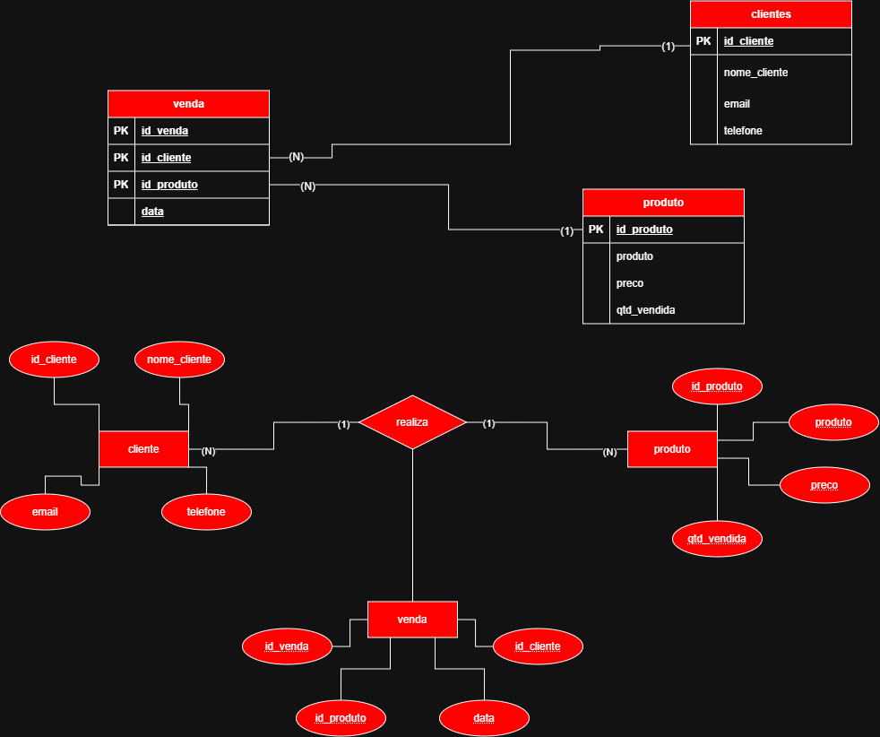
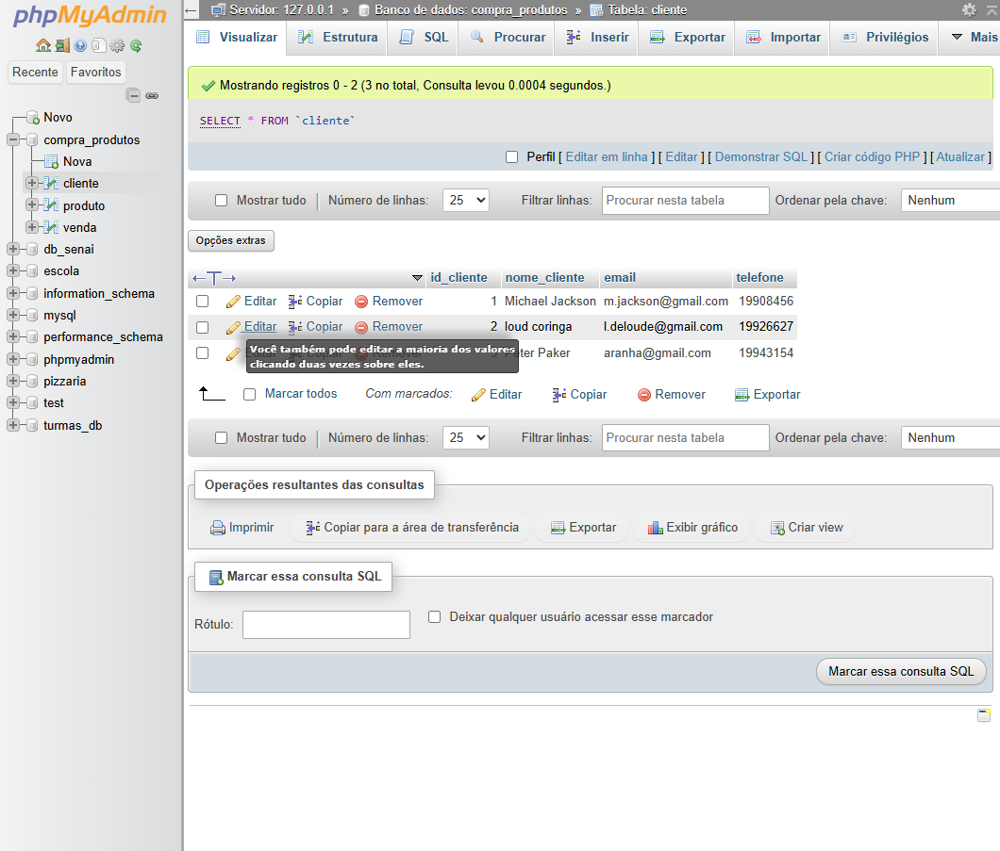
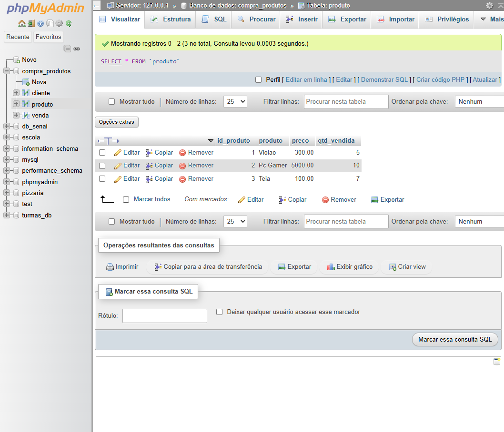
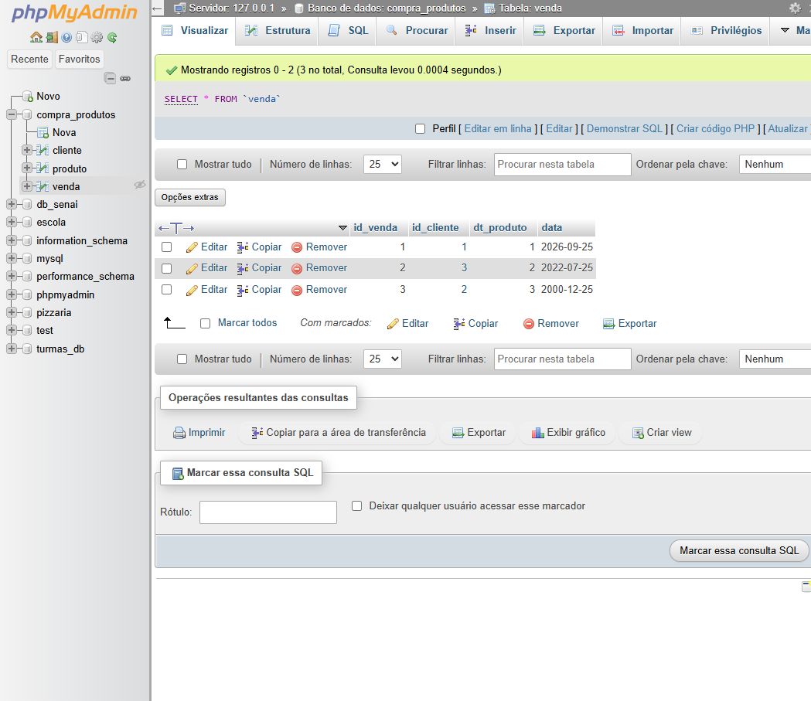
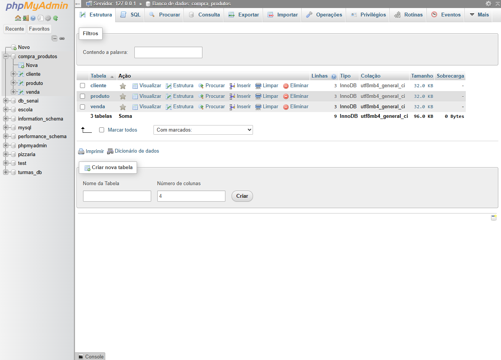
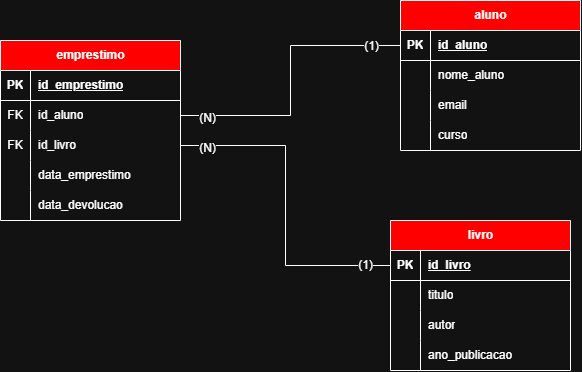

# atividades-BCD
Material desenvolvido em sala de aula

# ATIVIDADE 1

## Compra de Produtos

Projeto de banco de dados em MySQL para cadastro de clientes, produtos e vendas.

## Banco de Dados

sql
CREATE DATABASE compra_produtos;

USE compra_produtos;


 ## Tabela Cliente

```
CREATE TABLE cliente (
    id_cliente INT PRIMARY KEY AUTO_INCREMENT,
    nome_cliente VARCHAR(100),
    email VARCHAR(100),
    telefone INT
);
```

 ## Tabela Produto

```
CREATE TABLE produto (
    id_produto INT PRIMARY KEY AUTO_INCREMENT,
    produto VARCHAR(100),
    preco DECIMAL(10,2),
    qtd_vendida INT
);
```

 ## Tabela Venda

```
CREATE TABLE venda (
    id_venda INT PRIMARY KEY AUTO_INCREMENT,
    id_cliente INT NOT NULL,
    id_produto INT NOT NULL,
    data DATE,

    FOREIGN KEY (id_cliente) REFERENCES cliente(id_cliente),
    FOREIGN KEY (id_produto) REFERENCES produto(id_produto)
);
```

 ## Inserindo Clientes

```
INSERT INTO cliente(nome_cliente, email, telefone)
VALUES ("Michael Jackson", "m.jackson@gmail.com", "19908456");

INSERT INTO cliente(nome_cliente, email, telefone)
VALUES ("Loud Coringa", "l.deloude@gmail.com", "19926627");

INSERT INTO cliente(nome_cliente, email, telefone)
VALUES ("Peter Parker", "aranha@gmail.com", "19943154");

SELECT * FROM cliente;
```

 ## Inserindo Produtos

```
INSERT INTO produto(produto, preco, qtd_vendida)
VALUES ("Violao", 300.00, 5);

INSERT INTO produto(produto, preco, qtd_vendida)
VALUES ("PC Gamer", 5000.00, 10);

INSERT INTO produto(produto, preco, qtd_vendida)
VALUES ("Bolsa antifurto", 100.00, 7);

SELECT * FROM produto;
```

 ## Inserindo Vendas

```
INSERT INTO venda(id_cliente, id_produto, data)
VALUES (1, 1, "2026-09-25");

INSERT INTO venda(id_cliente, id_produto, data)
VALUES (3, 2, "2022-07-25");

INSERT INTO venda(id_cliente, id_produto, data)
VALUES (2, 3, "2000-12-25");

SELECT * FROM venda;
```

 ## Alteração

```
UPDATE produto
SET produto = "Teia"
WHERE id_produto = 3;

SELECT * FROM produto;
```

 ## Chave Única

```
ALTER TABLE produto
ADD CONSTRAINT uk_produto_unico UNIQUE (produto);

ALTER TABLE cliente
ADD CONSTRAINT uk_email_unico UNIQUE (email);
```

 ## Deletar Tabela

```
DROP TABLE produto;
```

## Banco de dados prontos






 ## Tecnologias

 - MySQL
- SQL


# ATIVIDADE 2

## Sistema de Biblioteca

# Banco de Dados Biblioteca

Projeto de banco de dados para gerenciamento de uma biblioteca, contendo alunos, livros e empréstimos.

## 1. Criar o Banco de Dados

```sql
CREATE DATABASE biblioteca;

USE biblioteca;

2. Criar a Tabela Aluno
CREATE TABLE aluno (
    id_aluno INT PRIMARY KEY AUTO_INCREMENT,
    nome_aluno VARCHAR(100),
    email VARCHAR(100),
    curso VARCHAR(100)
);

3. Criar a Tabela Livro
CREATE TABLE livro (
    id_livro INT PRIMARY KEY AUTO_INCREMENT,
    titulo VARCHAR(100),
    autor VARCHAR(100),
    ano_publicacao INT
);

4. Criar a Tabela Empréstimo
CREATE TABLE emprestimo (
    id_emprestimo INT PRIMARY KEY AUTO_INCREMENT,
    id_aluno INT NOT NULL,
    id_livro INT NOT NULL,
    data_emprestimo DATE,
    data_devolucao DATE,

    FOREIGN KEY (id_aluno) REFERENCES aluno(id_aluno),
    FOREIGN KEY (id_livro) REFERENCES livro(id_livro)
);

5. Inserir Alunos
INSERT INTO aluno (nome_aluno, email, curso)
VALUES ("Michael Jackson", "m.jackson@gmail.com", "Administração");

INSERT INTO aluno (nome_aluno, email, curso)
VALUES ("Loud Coringa", "l.deloude@gmail.com", "Análise e Desenvolvimento de Sistemas");

INSERT INTO aluno (nome_aluno, email, curso)
VALUES ("Peter Parker", "aranha@gmail.com", "Engenharia");

6. Consultar Alunos
SELECT * FROM aluno;

7. Inserir Livros
INSERT INTO livro (titulo, autor, ano_publicacao)
VALUES ("Dom Casmurro", "Machado de Assis", 1899);

INSERT INTO livro (titulo, autor, ano_publicacao)
VALUES ("O Hobbit", "J. R. R. Tolkien", 1937);

INSERT INTO livro (titulo, autor, ano_publicacao)
VALUES ("Harry Potter e a Pedra Filosofal", "J. K. Rowling", 1997);

8. Consultar Livros
SELECT * FROM livro;

9. Inserir Empréstimos
INSERT INTO emprestimo (
    id_aluno,
    id_livro,
    data_emprestimo,
    data_devolucao
)
VALUES (1, 1, "2026-09-25", "2026-10-02");

INSERT INTO emprestimo (
    id_aluno,
    id_livro,
    data_emprestimo,
    data_devolucao
)
VALUES (3, 2, "2026-09-20", "2026-09-30");

INSERT INTO emprestimo (
    id_aluno,
    id_livro,
    data_emprestimo,
    data_devolucao
)
VALUES (2, 3, "2026-09-15", "2026-09-25");

10. Consultar Empréstimos
SELECT * FROM emprestimo;

11. Alterar um Livro
O comando UPDATE é utilizado para alterar informações existentes na tabela.

UPDATE livro
SET titulo = "O Hobbit - Edição Especial"
WHERE id_livro = 2;

12. Consultar o Livro Alterado
SELECT * FROM livro;

13. Criar Chave Única para o Título
A restrição UNIQUE impede que existam dois livros com o mesmo título.

ALTER TABLE livro
ADD CONSTRAINT uk_titulo_unico UNIQUE (titulo);

14. Criar Chave Única para o E-mail
A restrição UNIQUE impede que dois alunos possuam o mesmo e-mail.

ALTER TABLE aluno
ADD CONSTRAINT uk_email_unico UNIQUE (email);

15. Excluir uma Tabela
O comando DROP TABLE exclui completamente uma tabela e seus dados.

DROP TABLE livro;
